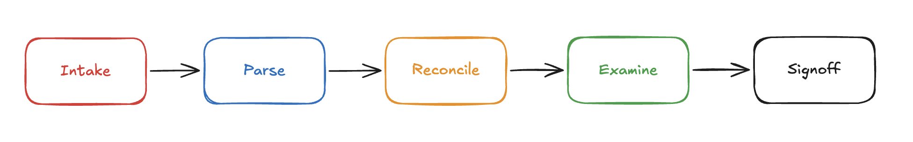
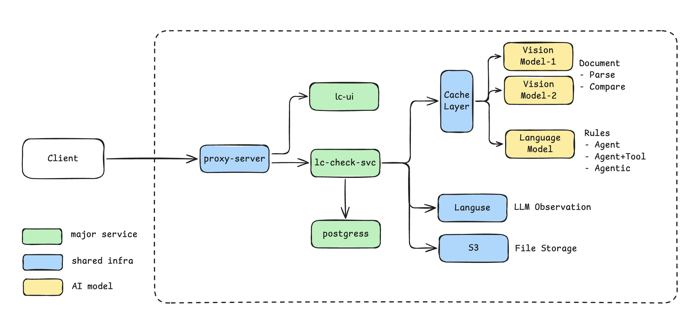

# LC Checker v2.0— Solution Document

## Versions

### v1.0 — LC Invoice Checker

A POC proving vision model and LLM integration for document data extraction and UCP 600 / ISBP 821 rule checking.

- git repo: https://github.com/smile-rr/lc-invoice-checker
- demo: https://lccheck.moments-plus.com/

------

### v2.0 — LC Checker, Multiple Document Support

Extends v1 with multi-document support and addresses real-world business implementation considerations for LC examination.

- git repo: https://github.com/smile-rr/lc-multidoc-checker
- demo: https://lccheck-v2.moments-plus.com/

## Operation Flow

v2's design view of the LC examination operational flow after AI integration — how the work
is shaped end-to-end with the LLM in the loop.

## Governance

The maintainable assets — rules, prompts, references — that the business and engineering teams
own jointly to keep the platform extensible.

## Rule Types

| **Type**          | **Description**                                              | **Reasoning** | Iteration    |
| :---------------- | :----------------------------------------------------------- | :------------ | :----------- |
| **Programmatic**  | SpEL expression checks. **No LLM.**                          | n/a           | 0 LLM calls  |
| **Agent**         | Single LLM call. Prompt includes fields and rules. Returns structured JSON. | false         | 1 LLM call   |
| **Agent + Tools** | LLM call with calculation tools (math, dates, currency).     | false         | ≤2 LLM calls |
| **Agentic**       | ReAct loop: reason → act → repeat. Has iteration limit.      | **true**      | ≤6 LLM calls |

## System Flow

The system deployment architecture and the runtime flow across its components.

## Implementation Strategy

| Phase                                        | Timeline | AI-Driven System                                             | Legacy System          |
| -------------------------------------------- | -------- | ------------------------------------------------------------ | ---------------------- |
| **Phase 1**   *Observation Mode*        | 6 months | • 100% parse verification   • 100% rule result verification    • 100% human sign-off | Parallel *(Primary)*   |
| **Phase 2**    *System-Assisted Review* | 3 months | • System randomly selects 50% for parse verification    • System randomly selects 50% for rule result verification    • 100% human sign-off | Parallel *(Secondary)* |
| **Phase 3**    *AI-Led Review*          | Ongoing  | • System randomly selects 30% for parse verification    • System randomly selects 30% for rule result verification    • 100% human sign-off | Sunset                 |