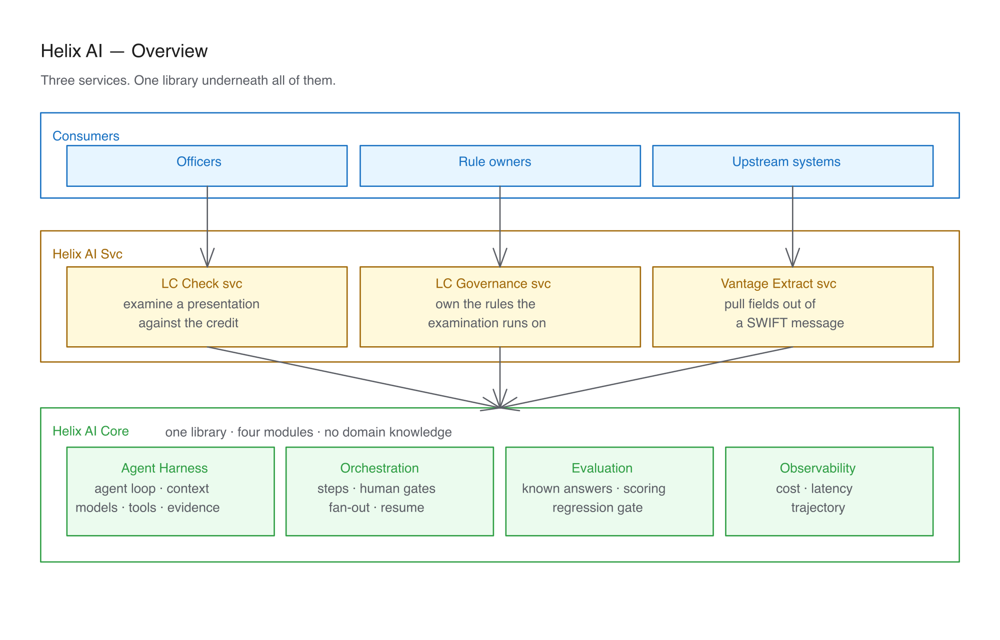
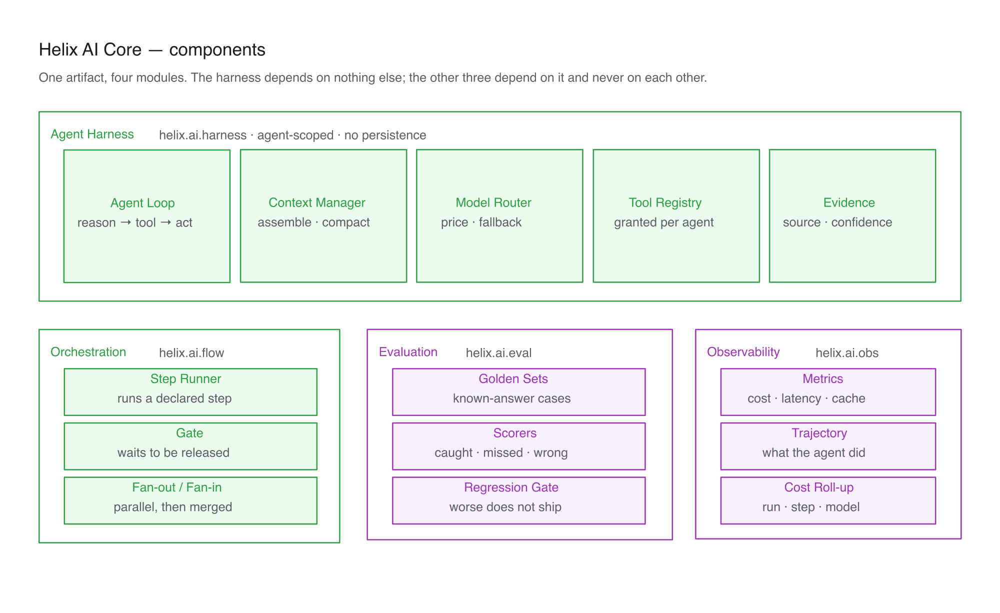
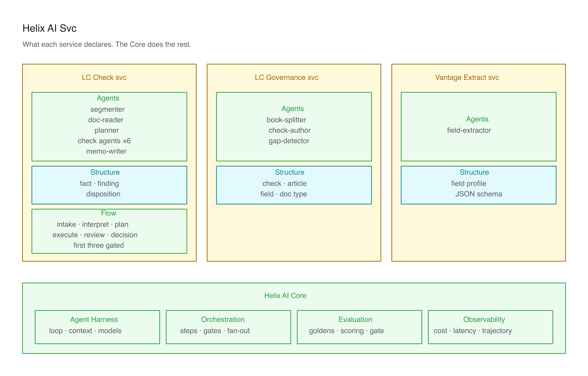

# Helix AI

Three services that declare their work, and one library that runs it.

- **LC Check svc** — officers examine a presentation against UCP 600 / ISBP 821. Interactive, gated, hours.
- **LC Governance svc** — owns the rules the examination runs on. Books, checks, agents, dictionary.
- **Vantage Extract svc** — pulls fields out of a SWIFT message. Headless, seconds, no human.

> **This is a design document.** Almost none of it is built yet.
> Detail: [`docs/architecture.md`](docs/architecture.md) · LC product: [`LC-Check.md`](LC-Check.md) ·
> Ops: [`AGENTS.md`](AGENTS.md) · Diagram sources: [`docs/diagrams/`](docs/diagrams/) (Excalidraw)

---

One artifact, four modules. The rule that holds it together: **the harness must not reach for
orchestration, or for a database.** Enforced as a package rule in the build.

Orchestration is a module of its own because Vantage Extract is a single agent with no steps and no
gates — a service that needs no orchestration should not inherit one.

---

https://claude.ai/share/3e621f0a-0c18-4fd2-90b8-2503c3fe9a06
With the Core carrying the loop, the context and the routing, a service is a flow, a set of agents,
and the shapes it returns.

Every agent is a file — a prompt, its tool grants, a model tier, a cap. Adding one is an edit, not a
release. LC Check owns no rules of its own: it pins a version published by Governance.
