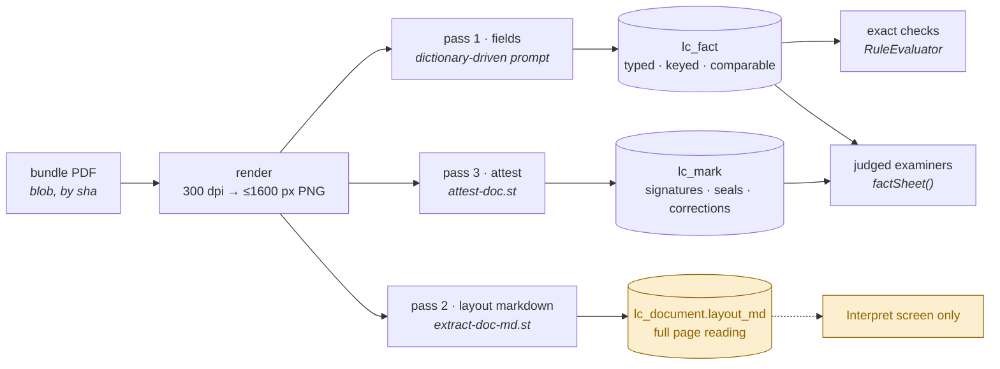
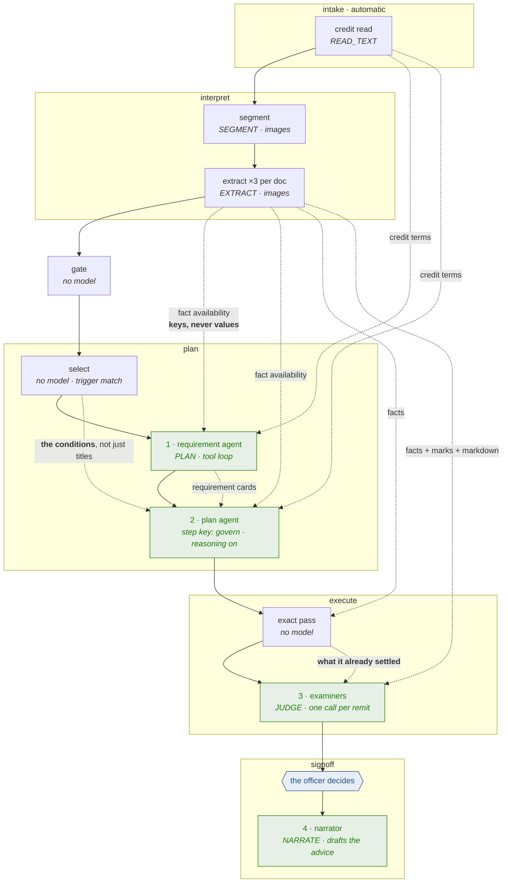
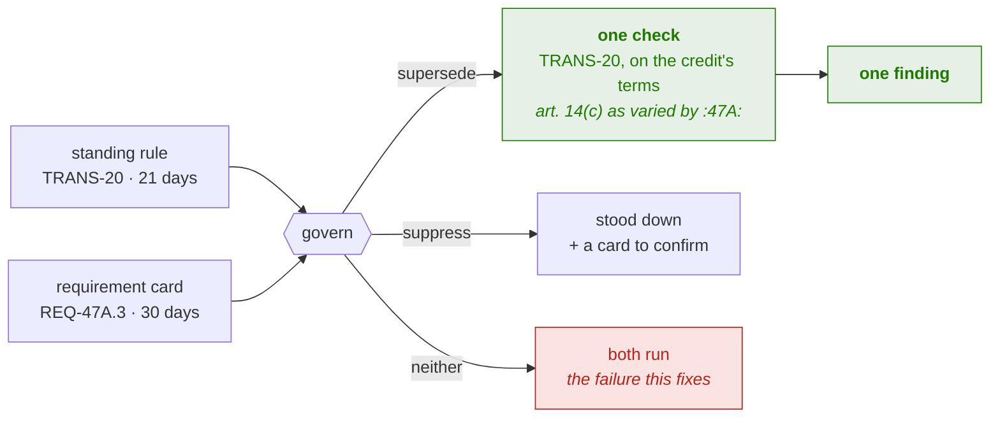
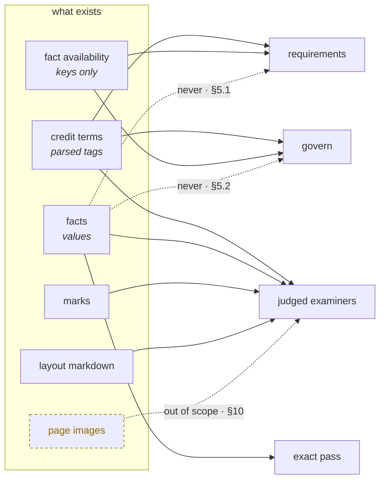

# Evidence and the agents

How many model calls the examination makes, what each is given, and why.

> This decides the **inputs**. The ordered implementation is
> [`docs/plan/expression-and-evidence.md`](../plan/expression-and-evidence.md).
> For where a class goes, see [`package-layout.md`](package-layout.md); for the authored rule
> language, [`rule-set.md`](rule-set.md).

---

## 1. Why this document

The examination makes three kinds of call that reason rather than read — the **requirement agent**,
the **plan agent** and the judged **examiners** — plus the exact pass, which makes none. Each
receives whatever the stage that wrote it happened to have in hand, and the omissions are not
decisions. They are oversights that have never been looked at together.

Six are worth naming before anything else:

- The **layout markdown** — a full, page-ordered transcription of every presented document,
  produced by a model call we already pay for and stored in `lc_document.layout_md` — is read by
  **the UI and nothing else**. No stage sees it.
- The **planner** is told nothing about what was actually extracted, so it can compile a condition
  against a field nobody reads. That check plans, stores, runs, and returns INCONCLUSIVE for ever
  while looking exactly like a check that ran.
- The **examiner** cannot tell a dictionary-bound reading from a field the extractor invented, or
  an amended credit term from an original one. `factSheet()` renders neither `flag` nor `source`.
- **A credit that varies a standing rule produces two cards and no way to join them.** UCP 600
  art. 14(c) gives 21 days; a credit saying *"documents may be presented within 30 days of
  shipment"* is not a second requirement, it is **the same requirement with a different number**.
  Today the standing rule is planned, a `REQ-47A.n` card is minted beside it, and the only verb
  that can reconcile them — `suppress` — raises a *third* artefact. §6.
- **The plan agent does not plan.** It is shown the standing checks as *titles* and its verbs only
  delete or halt, so it cannot say *"this rule applies, on different terms"*. Every credit-specific
  variation therefore survives to the run, fails, and reaches an officer as a manual override that
  the plan should have made. §5.0.1.
- **An examiner does not know what the exact pass already settled.** Both run in one step, exact
  first, and the fact sheet carries neither its outcomes nor its gaps — so a model can write *"the
  invoice value is within the credit"* onto the record beside a comparison that settled the
  opposite. §5.4.

---

## 2. What the system already produces

Every presented document is read **three times, sequentially, from byte-identical 1600 px page
renders**. The sequencing is deliberate: the three passes ride each other's prefix cache, and
firing them together would pay full image tokens three times over.



| carrier | what it is | provenance | who reads it today |
|---|---|---|---|
| **facts** (`lc_fact`) | the dictionary's questions, answered | doc code + page (§9) | exact checks and the fact sheet — fully consumed |
| **marks** (`lc_mark`) | what is on the page rather than in its text | doc code + page + placement | the fact sheet, as flattened prose |
| **layout markdown** | the whole document, in visual order, tables intact | page separators | **nothing but the UI** |
| **page images** | the truth | page number | interpret's three passes, then discarded (L1, 10 min, in-process) |
| **the credit** | SWIFT tags, parsed | per-tag anchors, minted and then dropped (§9.2) | intake → everything |

The first three are **already bought**. The decision is not what to pay for. It is what to show.

---

## 3. The choice: facts, markdown, or the page

The tempting framing is *the cheapest carrier that works*. It is the wrong one, because the three
do not answer the same question — and because the cost ordering is not stable.

### 3.1 Cost is not ordered the way it looks

**An image's cost is fixed by its geometry. Markdown's cost is set by how much the page says.**

| page | as an image (1600 px) | as markdown |
|---|---|---|
| a commercial invoice | ~1,500–2,500 tok | ~500–1,000 tok — markdown wins |
| a bill of lading, front | ~1,500–2,500 tok | ~700–1,200 tok — markdown wins |
| **a bill of lading, reverse** — carrier's standard conditions, 3,000 words of 6-point type | ~1,500–2,500 tok | **~4,000–5,000 tok** — the image wins, and the markdown answers nothing |

The reverse of a bill of lading is the worst case, and it is in almost every real bundle: the
largest markdown block in the presentation, carrying the least. Any design resting on *"markdown is
cheaper"* is wrong on exactly the page that costs the most.

### 3.2 Fidelity is not ordered the way it looks either

Markdown is **a lossy transcription made by a model** — one reading of the page, frozen. It renders
a signature as an italic note, and whether a stamp was legible was a judgement made at
transcription time by a prompt that was not asking about legibility. The image carries the truth;
the markdown carries an opinion about it.

But the image is not simply better, because **a general examiner handed a page asks worse questions
of it than the attest pass already asked.** `attest-doc.st` asks about facsimile and perforated
signatures and chops (UCP 600 art. 3), about corrections and the initials that authenticate them
(ISBP 821 §A), about `ORIGINAL` marking (art. 17), about the capacity a signature was given in
(art. 20(a)(i)). It also holds the distinction that matters most, and that a general reader loses:

> *"There is a signature and I cannot read whose it is"* is **not** the same statement as
> *"this document is unsigned"*. Only the second is a discrepancy.

### 3.3 The rule

Choose by **what the check asks**, never by what the carrier costs.

| the check asks | carrier | why |
|---|---|---|
| does field X on this document agree with field Y on that one | **facts** | it is a comparison, a comparison needs values, and values are what facts are |
| does this document's wording correspond with the credit's | **markdown** | wording judgements need the whole wording in its own order — folding it into fields is what destroyed the information |
| is it signed, sealed, altered, marked original, signed in a stated capacity | **marks** | the question was already asked by a prompt that knew which articles govern it. Re-sending the page to ask it worse is paying twice for less |
| nothing above can settle it | **the page** | out of scope this round — §10 |

Which answers the three standing questions directly:

1. **Markdown or the pages?** Markdown, for wording. Never the pages, this round.
2. **Facts or the pages?** Facts, for comparison. The extraction already happened; re-reading a page
   to recover a value we are holding is two completions for no new information.
3. **Signature detection — the prior result, or the page?** **The prior result.** The attest pass is
   a better instrument than the question a general examiner would think to ask, and its answer is
   already stored.

---

## 4. An operand must trace to a document

A separate constraint, and the one that keeps the catalogue honest.

Every operand and every literal in a condition must be traceable. Four forms are legitimate:

| form | example | traces to |
|---|---|---|
| a field on a presented document | `{BOL.on_board_date}` | the presentation |
| a field on the credit | `{LC.latest_shipment_date}` | the credit |
| a constant from the **rulebook** | `21` in *"within 21 calendar days of shipment"* | UCP 600 art. 14(c), cited on the check |
| a literal **quoted from this credit** | an issuer named in tag 47A | 47A, with the quote recorded on the card |

And one is not: **a constant the author typed because they know this deal.** A standing rule in the
catalogue applies to every credit. A standing rule naming a port, a party or an amount is a rule
about one transaction wearing a rulebook's clothes — it will be wrong on the next credit, and
silent about it.

The split follows the card's own provenance, and is enforceable:

- a **dictionary** check (`origin = DICTIONARY`) may carry rulebook constants only. A business
  literal in one is a compile-time warning.
- a **requirement** card (`origin = CREDIT`, ids `REQ-46A.n` / `REQ-47A.n`) may carry a literal,
  because it is scoped to this credit and the planner read it out of 47A — but the quote and its
  tag must ride beside it, so a person can check that the credit really says so.

> This is also why the planner is given the credit's terms and not the presentation's values
> (§5.1). A literal must come from what the credit **demands**, never from what a document happens
> to **say**: a condition compiled from the presentation is a rule that passes by construction.

---

## 5. The agents

### 5.0 How many, what they are called, and why not more

**Four kinds of reasoning call, and the fourth writes rather than decides.**

| # | agent | step key | calls per case | its act |
|---|---|---|---|---|
| 1 | **requirement agent** | `requirements` | 1 (a tool loop) | reads the credit's demands out of 46A/47A and compiles what it can |
| 2 | **plan agent** | `govern` | 1 (reasoning on) | decides the plan: which standing rules run, on whose terms |
| 3 | **examiners** | `checks` | one per remit | answer the judged checks in their domain |
| 4 | **narrator** | `signoff` | 1, after the officer signs | drafts the advice from the discrepancies a person confirmed |

> **On the names.** *govern* is what the step key says and *plan agent* is what it is; the prose
> here uses the agent name and the tables carry the key, because renaming a step key rewrites
> `lc_run_step` rows, the step tape and every `stepResult(PLAN, …)` lookup for a word. The stage is
> already called `plan`, so `plan/plan` would be its own confusion — the key stays `govern`.

### 5.0.1 Does the plan agent actually plan?

Today, no — and that is the gap behind *"so a manual override will always happen"*.

```
select        no model   every standing rule whose doc-type trigger is met  →  PLANNED
requirements  model      reads 46A/47A                                      →  REQ cards
plan agent    model      given a LIST of both                               →  suppress · veto
```

The plan agent is handed **titles**, and its only verbs delete or halt. It cannot say *"this rule
applies, on different terms"* — so every credit-specific variation survives to the run, fails, and
lands on an officer as a manual override. The override is not the officer catching a subtlety; it
is the plan agent having had no way to say what it could see.

**The fix is not more planning, it is more vocabulary.** Two changes, and the act becomes real:

| | today | after |
|---|---|---|
| what it sees | id, title, tier, citation | **the conditions too** (`ConditionPrinter`, §6.5) |
| what it may do | `suppress`, `gateOverride`, `runRemaining`, `humanReview` | **+ `supersede`**, row-level (§6) |

`select` stays mechanical, and deliberately: trigger-matching is free, deterministic and
reproducible, and a model re-deriving it would make the plan differ between two runs of one case.
**Every check is *shown* to the plan agent; none requires it to act.** Silence means *runs as
authored*, which is the safe default and costs nothing — the plan agent's job is the exceptions,
and its act is to **vary**, not merely to veto.

Three principles decided the count, and each rejects an agent that looked reasonable.

**A new agent must hold something no existing agent holds.** The obvious candidate was a
*reconciler* sitting between `requirements` and `govern`, to spot that a credit clause varies a
standing rule. It was rejected because **`govern` already receives both lists** — `STANDING RULES
SELECTED FOR THIS PRESENTATION` and `REQUIREMENTS READ FROM THIS CREDIT` — and reconciling them is
its literal job description. What it lacked was not context but a **verb**, and a verb is cheaper
than a call. §6.

**Do not give `requirements` the standing rules.** It would let the reader of 47A say *"this varies
TRANS-20"* at the moment it reads the clause, which is tempting. But a reader handed twenty rules
maps every clause onto one of them, and 47A's most dangerous clauses are the ones that match
nothing. It is also a tool loop under a turn budget, and reconciliation would compete with
compiling conditions for the same turns. The reading stays a reading.

**Duplication is a planning defect, not a reporting defect.** The instinct after seeing two
findings about one fact is to add a consolidation pass over the findings. That is what you build
when you cannot reach the cause. Here we can, in two places — graded clauses inside one check, and
`supersede` across two cards — and both remove the duplicate **before anything is paid to run
twice**. §10 is why there is no consolidator.



### 5.1 The requirement agent — reading what the credit demands

**Its question:** what does this credit require, and which requirements can be settled by comparison
rather than by reading?

| | given | why |
|---|---|---|
| keep | `plan-requirements.st`, the document-type codes, the comparable-field vocabulary by document, the operators, the functions | it is compiling, and it needs the vocabulary it must compile into |
| keep | tag 46A, tag 47A | the two blocks the requirements are read out of |
| **add** | **the credit's other terms** — the parsed tag map, not just 46A/47A | 47A routinely references tags it does not restate: *"presentation within the validity of the credit"*, *"shipment as per 44C"*. Today the planner cannot see 44C and must guess or give up. The data is already loaded and costs one block |
| **add** | **fact availability** — per document, which field keys came back with something, which came back empty, which documents were not presented. Keys only | two failures, one block. It stops the planner compiling against a field nobody extracts — the check that plans, stores, runs and returns INCONCLUSIVE for ever while looking like a check that ran. And it shows which demands are simply unanswerable this time, so they can be raised as human cards instead of as conditions |
| **never** | field **values** | the planner writes conditions. Handed values it answers them instead, and the answer is a model's opinion wearing an exact check's clothes. It also breaks §4 |
| **never** | page images | 46A/47A are text in the credit, and a credit that arrived as a scan was already transcribed upstream by `CreditScanTranscriber`. An image here pays interpret's bill a second time for a question that is not about the page |
| **never** | layout markdown, marks | it is reading the **credit**, not the documents. What the documents say is execute's question, and answering it here would answer it in the wrong place with the wrong vocabulary |

**Tools:** `check_condition` and `article_text`, both already present. **No fact-query tool** — the
availability list is small enough to inline, and a tool returning values reintroduces exactly the
failure the keys-only rule exists to prevent.

**A consequence to state where it will be noticed.** `requirements` keys its derivation cache on the
volatile digest, so adding availability means two presentations with different extraction outcomes
stop sharing a cached plan. That is correct — they *should* get different plans — but the hit rate
will fall, and it will read as a cost regression unless the step's completion note says so.

### 5.2 The plan agent — deciding the plan

**Its question:** given this credit and this presentation, which of these checks should actually
run, and what must a person be asked?

| | given | why |
|---|---|---|
| keep | the threshold verdicts, the credit terms, 46A, 47A, the candidate standing rules, the requirement cards | its whole job is weighing these against each other |
| **add** | **fact availability** — the same block | *is this check worth running* is partly *can it be answered at all*. A check whose operands read fields nobody extracted will cost a model call to return INCONCLUSIVE. Govern is the only place that can stand it down — and the only place that raises the card which makes standing it down safe |
| **never** | facts, marks, markdown, images | **govern's output vocabulary has no slot for a conclusion.** It returns `suppress`, `gateOverride`, `runRemaining`, `humanReview`; there is nowhere to record a finding. Giving it evidence therefore produces either a conclusion that is discarded, or worse, one that leaks out as a suppression — a check stood down because the model privately decided it would have passed. That is a finding with no evidence trail and nobody's signature on it |

**Its output vocabulary gains one verb**, `supersede` — see §6. That is the whole of the change:
`govern` already holds both lists and already reasons; it simply had no way to say *"these two are
one thing"*.

The standing constraint holds unchanged and is what makes any of this safe: **a suppression always
raises a review card**, and the planner cannot stop a run no threshold check objected to. A
supersession is different in kind and therefore differently constrained — §6.7.

### 5.3 `execute` — the exact pass

No model. Operands resolve against `lc_fact`, the condition is walked, and every row's working is
written to `lc_finding.comparison` as the evidence a refusal is defended on.

Nothing is added here. What is needed here is **fidelity**, not more evidence — §9.

### 5.4 `execute` — the judged pass

**Its question:** read this presentation and answer these checks, which fall in your remit.

| | given | why |
|---|---|---|
| keep | `examine-checks.st`, the shared fact sheet, the remit (agent behaviour + article text), the checks | unchanged |
| **add** | **quality signals inside the fact sheet** — an off-dictionary reading marked visibly; a credit term's source carried, so an amended term is distinguishable from an original | today an invented field and a dictionary-bound one are typographically identical to the judge, and so are an amended term and an original one. Both failures are silent, and both change the answer |
| **add** | **the layout markdown of the documents this examiner's checks name**, placed **after** the shared fact sheet | already paid for, page-ordered, and the only place a table survives intact (§9.1). A wording check — *does the invoice's goods description correspond with the credit's* — needs the wording, and folding it into fields is precisely what destroyed it |
| not this round | page images | §10 |

| **add** | **what the exact pass already settled** — check id, subject, outcome | see below |

**Scoping and the cap.** Markdown is included only for documents named by this remit's checks, and
is capped per document with the truncation **stated in the block**. The reverse of a bill of lading
is the reason. Silent truncation would read as *"you have been shown the whole document"*, which is
the one thing evidence must never do.

#### The examiner does not know what the exact pass concluded

Both passes run inside one step and **exact runs first** — but `factSheet()` is the credit, the
facts and the marks, and nothing else. So an examiner can write *"the invoice value is within the
credit"* onto the record while `AMT-18` has already settled that it is not, and both statements
reach the officer as findings of equal standing.

A one-line-per-check summary of the settled outcomes goes in the **shared** block, where it is
byte-identical for every examiner and costs the prefix nothing:

```
ALREADY SETTLED BY COMPARISON
  AMT-18    invoice value against the credit amount        DISCREPANT
  SIGN-20   transport document signed, with capacity       CLEAN
  TRANS-20  on-board date against latest shipment          COULD NOT BE ANSWERED — on_board_date not read
```

Outcomes only, not the working: an examiner is being told what is already answered so it does not
answer it again, not being invited to review it. The third line is the one that earns the block —
*"nothing settled this"* is exactly what an examiner should be told before it forms a view.

#### Grouping: by remit, not by document type

Grouping by doctype is the obvious idea and it is wrong twice.

- **It cannot express the work.** UCP examination is inherently cross-document — *does the
  invoice's goods description correspond with the credit's*, *does the B/L consignee match*. The
  seeded `XD-14` is literally *"Documents do not conflict with each other"*. A group scoped to one
  document cannot hold a check that reads two.
- **It is worse for the cache, not better.** A prefix cache rewards a common **leading** run. With
  remit grouping, blocks 1–2 — the instruction and the whole fact sheet — are identical across
  every call, and that is the large shared prefix the first-group-alone design exists to warm. With
  doctype grouping every call opens with a different document, so nothing is shared past the
  instruction.

What doctype grouping was reaching for is real, though: two remits that both name the bill of
lading each carry its markdown. The fix is not a different grouping but a **placement rule**:

> **A document's markdown goes in the shared block when more than one remit needs it, and in the
> remit's own block when only one does.**

Computable before any call is made, it maximises the identical prefix and sends nothing twice.

**No sessions.** Reusing context by keeping a conversation open would make the answer depend on
call order and defeat the derivation cache, which is content-addressed on purpose — a case must
re-run to the same answer. The prefix cache already gives the saving, without state.

#### Tools and expressions: not for the examiner

The standing rule is *tools go to the planner, not the run*, because the examination already holds
the facts and a round trip to fetch what we are holding is two completions for no new information.

**Emitting an expression is a different proposal and deserves its own answer**: a model doing
arithmetic in prose is unreliable, and an expression it emitted would be evaluated exactly and
reach the officer as a `ComparisonView` — an opinion converted into evidence. That is genuinely
attractive, and it is still **deferred**, for three reasons:

1. **If the examiner can compile it, the planner should have.** The check is judged *because*
   nothing compiled it. The durable fix is the planner compiling more (Stage C), which fixes it for
   every future case rather than for this call.
2. **It costs the cost story.** One call per examiner is the whole design; a tool loop makes it
   several, and `max-iterations` treats a spent budget as **no answer** — so a loop can turn a
   cheap answer into none.
3. **`CheckType` already anticipates it** — `AGENT_TOOL` and `AGENTIC` are authored intents the run
   ignores. The shape exists; wiring it is a decision to take once, deliberately, not a side effect
   of adding a calculator.

If it is ever built, the narrow form is the right one: **not `fetch`, but `evaluate` — an
expression over the facts already in the prompt**, returning a comparison row rather than a
sentence. Reaching for data is what the fact sheet is for; deriving from it is the gap.

### 5.5 The narrator — drafting the advice

**New, and the answer to *"do we need a last agent to review and finalize?"*: yes to the writing,
no to the reviewing.**

`LlmRole.NARRATE` is already in the enum and already mapped to a slot in `application.yml`. It is
called from nowhere. `SignoffStage` assembles the MT734 by string concatenation, which is why the
advice reads like a database and not like a notice.

**Its question:** given the discrepancies a named officer has confirmed, write the notice.

| | given | why |
|---|---|---|
| the confirmed discrepancies — statement, article, document, and the officer's own note | its subject |
| the credit's identifying terms | a notice names the credit |
| the field 77J constraints and the house wording | it is drafting to a form |
| **never** the facts, the markdown, the pages | it is not examining. Anything it could conclude from evidence would be a ground nobody signed |

**Four constraints, and they are what make it safe:**

1. **It runs after the officer's decisions, not before.** A drafter that ran first would be
   choosing what the notice says, and the officer would be editing a model's argument instead of
   stating their own.
2. **It may not add a ground, drop a ground, or change an outcome.** Its input is the confirmed
   set and its output is prose about exactly that set. A ground that appears in the draft and not
   in the findings is a defect, and is checkable — the two lists must correspond one to one.
3. **Art. 16(c) is a hard shape, not a style.** One notice, stating **every** discrepancy. That is
   precisely why the drafter must not select: a notice that omits a ground forfeits it.
4. **The officer signs the draft.** It is a first draft of a document a person is accountable for,
   which is the only footing on which a model may write anything that leaves the bank.

**Why this is the only "final agent" worth having.** The tempting version reviews the findings and
finalizes them — resolves contradictions, merges duplicates, forms a view. Every one of those is a
decision, and this system's premise is that a person makes those: the machine's outcome is never
overwritten, an override is a second value beside it carrying a named person and a time, and the
Decision tab exists so that someone chooses. An agent that reviews and finalizes is that person,
unaccountable. Drafting is the one act at the end of the run that adds real value and decides
nothing.

---

## 6. When the credit varies a standing rule

### 6.1 The problem: one requirement, three artefacts

UCP 600 art. 14(c) gives 21 calendar days for presentation. A credit says:

> *"Documents may be presented within 30 days after the date of shipment."*

That is **not a second requirement.** It is the same requirement with a different number, and the
credit's number wins. What happens today:

```
select        plans TRANS-20            presentation within 21 days   (UCP 600 art. 14(c))
requirements  mints REQ-47A.3           presentation within 30 days   (compiled, exact)
govern        may suppress TRANS-20  →  and a suppression always raises a card

  three artefacts, two of them noise, and if govern does nothing:
  two exact checks on one fact, one of which is wrong, both DISCREPANT
```

The failure is not that the model behaved badly. **There is no verb in `govern`'s vocabulary that
says what actually happened.** `suppress` means *the credit excuses this check* — it stands the
rule down and asks a person to confirm, which is right when 47A waives something and wrong here,
because nothing was waived: a rule was **restated on different terms and still applies**.

### 6.2 The verb

`govern`'s output gains `supersede`, beside `suppress`:

```json
"supersede": [
  { "checkId": "TRANS-20",
    "byRequirement": "REQ-47A.3",
    "because": "The credit states its own presentation period, which replaces the 21 days art. 14(c) allows.",
    "quote": "DOCUMENTS MAY BE PRESENTED WITHIN 30 DAYS AFTER THE DATE OF SHIPMENT" }
]
```

| verb | what the credit did | what runs | what the officer sees |
|---|---|---|---|
| `suppress` | excused the rule | nothing | a card asking them to confirm the excusal |
| **`supersede`** | **restated the rule on its own terms** | **one check, on the credit's terms** | **one card, showing the variation and its quote** |
| `gateOverride` | bears on the ground a threshold check failed on | unchanged | the override and its reason |

### 6.3 Which card survives, and why it is the standing one

The two cards merge into **the standing rule's card**, whose *condition* is replaced by the one the
planner compiled from the credit. The requirement card is recorded as merged, and does not run.

That direction is not arbitrary — three things live on the standing card and nowhere else:

- **The citation.** A refusal notice states a ground under an article. `TRANS-20` carries `refs`
  and `citedAs`; a `REQ-` card carries a tag number. The notice must say art. 14(c) *as varied*,
  not *:47A: item 3*.
- **The examiner remit.** Judged checks group by the agent whose domain claims the check.
  A credit-origin card short-circuits to a synthetic `Additional conditions` domain, so merging the
  other way would move the check out of the remit of the examiner who should answer it.
- **The identity across cases.** `TRANS-20` is the same id on every presentation, so *"how often
  does a credit vary the presentation period"* is a question the case history can answer. A
  `REQ-47A.3` is a different clause on every credit and answers nothing across cases.

What the merged card must carry, so the variation is never silent: the credit's compiled condition,
the **quote** and its tag, and the original condition it replaced. `appliesBecause` becomes
*"UCP 600 art. 14(c), as varied by :47A: — 30 days rather than 21"*.

### 6.4 A standing check is not one subject, so the merge is per row

The first draft of this section replaced a whole card, and that is wrong. The seeded `TRANS-20`
is four comparisons about four different things under one title:

```
TRANS-20  "Bill of lading on-board notation"        cites UCP600 Art.20
  r1  BOL.on_board_date      d_lte     LC.latest_shipment_date      shipment not late
  r2  BOL.port_of_loading    eq        LC.port_of_loading           loading port
  r3  BOL.port_of_discharge  eq        LC.port_of_discharge         discharge port
  r4  CS.presentation_date   d_within  BOL.on_board_date   tol=21   presentation period
                                                                     ↑ 47A varies only this
```

Superseding the card would discard three correct comparisons to fix a fourth. (Note also that r4
is UCP 600 art. 14(c), not art. 20 — this card's title and citation do not cover its own fourth
row. A card carrying four subjects also writes **one finding for four different failures**, which
is the duplication problem arriving from the opposite direction. `TRANS-20` is mis-authored and
should be split; that is a catalogue fix, not a design one.)

**So a supersession replaces a row, not a card** — and which row is not something the model is
asked to name.

### 6.5 The model proposes, the operands verify

`govern` names the pair. **The code decides whether they are the same subject**, by matching the
requirement's compiled condition against the standing check's rows on **the left operand**:

```
REQ-47A.3    CS.presentation_date  d_lte     date_plus(BOL.on_board_date, 30)
TRANS-20 r4  CS.presentation_date  d_within  BOL.on_board_date          tol=21
             └──── the subject ───┘          └───── the yardstick ─────┘
                                → row-level supersession; r1–r3 untouched
```

**The left operand alone, not both sides.** The left operand is *what the row constrains* — its
subject. The right side is the yardstick, and varying the yardstick is precisely what a credit is
entitled to do: *"the presentation period runs from the date of issue rather than the on-board
date"* changes the right operand and is still the same subject. Requiring both sides to match
would refuse exactly the case this exists for.

That works because **a row's left operand is unique within its check** — verified across both
catalogues: sixteen checks carrying conditions, zero collisions. It is not luck. A row is a
constraint on one thing, and the thing it constrains is its left operand, so
`(checkId, left doc.field)` is a row's natural key.

No match, no supersession: the claim is **refused**, and both cards are raised for a person.
Guessing which clause governs which comparison is exactly the judgement that is not ours.

This is what makes §6.7's first constraint enforceable rather than aspirational. *"The model says
these are the same"* is a sentence in a cache entry; *"the operands are the same"* is a check.

**It also fixes a hole this question exposed.** `govern` is currently told only
`TRANS-20 — Bill of lading on-board notation [exact, cites UCP600 Art.20]` — the title, the tier
and the citation, and **not the condition**. Asked to match a 30-day presentation clause against
that title, it can only guess. So `describeChecks` must render each exact check's operands, which
is `ConditionPrinter` — scoped as a Stage C migration tool, and now load-bearing for this.

### 6.6 What if the credit's version did not compile

The dangerous branch, and the reason a supersession transfers a **subject** rather than a
*condition*.

*"Documents may be presented within 30 days after shipment"* does not always compile. The field may
not have been read, or the clause may be phrased in a way no operator expresses. The card is then
judged. If a supersession required a compiled replacement, the merge would simply be blocked, and:

```
TRANS-20 r4   still runs at 21 days   →  DISCREPANT   ← a ground the credit excused
REQ-47A.3     a judged card           →  asks a person the same question

  two artefacts, one of them wrong and confident — the failure this whole section exists to prevent
```

So the row's fate depends on whether the replacement compiled, and all three outcomes are safe:

| the requirement | the standing row | what verifies it | card raised |
|---|---|---|---|
| compiled, left operand matches | **replaced** by the credit's condition | the operands | no — the merged card is the evidence |
| compiled, no row matches | **refused** — nothing changes | the operands | yes, both cards |
| **judged** (did not compile) | **stood down**, and recorded as stood down | nothing mechanical | **yes** |

The third row is the addition, and its card is not a formality. A judged requirement carries no
operands, so nothing can check that it really governs the row it claims — and accepting it trades a
determinate comparison for an opinion. That is the same trade a suppression makes, and it gets the
same treatment for the same reason: **a comparison is only ever lost with a person's agreement.**

### 6.7 The constraints

A supersession is a stronger act than a suppression — it does not merely stand a rule down, it
**changes what the rule says** — so it is more tightly bound, not less.

1. **Same subject, and the operands must say so** wherever operands exist. Verified in code, not
   asserted by the model — §6.5. The quote is mandatory either way, and the merged card shows the
   replaced row beside the replacing one, so an officer can see that 21 became 30 and disagree.
2. **A judged requirement may supersede, but only with a card.** §6.6. What it may never do is
   replace a row *silently* — an opinion reported under an exact rule's citation, with no comparison
   behind it and nobody's agreement to its loss.
3. **A compiled supersession does not raise a card, and that is the point.** A suppression must,
   because the check stopped running and nobody would otherwise know. A compiled supersession
   leaves a check that **runs and answers**, on terms the card states in the credit's own words —
   the evidence is the card, not a question about it.
4. **One *row*, one supersession** — not one rule. A single 47A clause may legitimately vary rows
   in two different standing checks, and forbidding that would refuse a correct reading. What must
   not happen is two requirements claiming the same row: the second is refused and both are raised,
   because guessing which clause governs is exactly the judgement that is not ours.
5. **A superseded row is never also suppressed.** The two verbs are mutually exclusive on one row,
   and a verdict asserting both is refused rather than resolved by precedence.
6. **A judged standing check cannot be superseded at all** — it has no rows, so there is no subject
   to transfer and nothing to verify. `suppress` is the verb for that, and the credit's card runs
   beside it.

### 6.8 What this leaves



Together with graded clauses — which merge two conditions *inside* one check — this removes
duplication at both places it is created: **across two cards at plan time, and within one card at
authoring time.** Neither needs a pass that reads the findings afterwards, which is §10.

---

## 7. Merging the examiner prompt

The answer to *how does it merge* is an ordering, and the ordering is a cost decision rather than a
style one.

```
┌─ the prefix the first group warms, and every later group rides ─────────────┐
│  1  HOW TO ANSWER                    stable   examine-checks.st             │
│  2  THE PRESENTATION                 shared   facts · marks · credit terms  │
│  3  ALREADY SETTLED BY COMPARISON    shared   the exact pass's outcomes     │
│  4  DOCUMENTS MORE THAN ONE REMIT NEEDS   shared   hoisted markdown         │
└─────────────────────────────────────────────────────────────────────────────┘
   5  THE DOCUMENTS IN YOUR REMIT      per-remit   markdown only this remit needs
   6  YOUR REMIT                       per-remit
   7  THE CHECKS                       per-remit
```

Blocks 2–4 are **shared**: the same bytes on every examiner call about this case, and different for
the next case. Block 4 is the placement rule from §5.4 — a document needed by two remits is hoisted
above the boundary and sent once, instead of appearing in two per-remit blocks and matching neither.

`execute` runs the **first group alone** and fans the rest out behind it, precisely because a
provider only holds a prefix once a call carrying it has returned. That warming works only while
blocks 1–2 are identical across examiners.

**So the new markdown block sits below the boundary, not above it.** Per-remit documents before the
shared fact sheet would give every examiner a different prefix, and the first-group-alone design
would become pure latency for no saving — a regression that surfaces as a cost number nobody can
trace back to a block ordering.

`PromptContext` renders `STABLE` then `VOLATILE`, but blocks 2–5 are all volatile today, so the
boundary is **positional and maintained by hand**. It should be a type — a third tier rendering
between the two — so the constraint is enforced rather than remembered.

---

## 8. What each call receives, end to end



| | credit terms | fact availability | fact values | marks | markdown | images | the conditions | settled outcomes | findings |
|---|:---:|:---:|:---:|:---:|:---:|:---:|:---:|:---:|:---:|
| **requirement agent** | ✅ *widen* | ➕ | ❌ | ❌ | ❌ | ❌ | ❌ | — | — |
| **plan agent** | ✅ | ➕ | ❌ | ❌ | ❌ | ❌ | ➕ | — | — |
| **exact pass** | ✅ | — | ✅ | ❌ | ❌ | ❌ | ✅ | — | — |
| **examiners** | ✅ | — | ✅ ➕ *signals* | ✅ | ➕ *remit-scoped* | ❌ §10 | ❌ | ➕ | — |
| **narrator** | ✅ *identifying only* | ❌ | ❌ | ❌ | ❌ | ❌ | ❌ | — | ➕ *confirmed only* |

Three rows in that table are the whole of this document's change to the plan and the run:

- **the plan agent gets the conditions**, so it can vary a rule instead of only deleting it
- **the examiners get the settled outcomes**, so two halves of one examination stop contradicting
  each other on the record
- **the narrator gets the findings and nothing else about the presentation**, because it is not
  examining. A drafter that could reach the facts could reach a ground nobody signed, and a ground
  in the notice that is not in the findings is the one defect a refusal cannot survive.

---

## 9. What must be fixed before an exact check can be trusted

Upstream of everything above, and of the condition-language work. A comparison is only as good as
the value underneath it, and three defects make some values **wrong** rather than missing — which
is worse, because a wrong value produces a confident discrepancy.

### 9.1 A repeated or tabular field is destroyed, and the loss looks like a discrepancy

Three independent chokepoints, each fatal on its own: the extraction prompt asks for *"a flat object
of field name to value"*; `ExtractionSpec.read()` uses `putIfAbsent`, so a second value for a folded
key is dropped; and `lc_fact` carries `UNIQUE (case_id, doc_code, label)`. When the model does
return a list, `FactWriter` serialises it into one TEXT cell and `value_norm` uppercases the JSON.

```
a bill of lading with two loading ports

  stored     BOL.port_of_loading = '["SHANGHAI","NINGBO"]'      ← one cell
  compared   LC.port_of_loading  eq  BOL.port_of_loading
             "SHANGHAI"  vs  '["SHANGHAI","NINGBO"]'   →   DISCREPANT

  a discrepancy that does not exist, indistinguishable from one that does
```

A packing list's item table goes the same way. **The prompt shape has to change first** — no schema
change alone reaches it.

**The fix.** Let the dictionary mark a binding `repeatable`; let the extraction prompt return an
array for those; give `lc_fact` an `ordinal` and move the unique key to
`(case_id, doc_code, label, ordinal)`; and give the condition language set semantics
(`anyOf` / `allOf` / `noneOf`) so a multi-valued operand is comparable rather than string-matched.
Both sides of such a comparison remain fields — nothing is hardcoded (§4).

**The safe minimum, if the full fix must wait:** `FactWriter` flags a value it had to serialise, and
the evaluator returns **INCONCLUSIVE** rather than FAIL on a flagged operand. Every multi-valued
field then falls to a person, which is honest and cheap. What is not acceptable is leaving it as it
is, because the current behaviour is a confident wrong answer.

### 9.2 Provenance below the document does not exist

`FactWriter` stamps every fact with the document's **first** page — every fact on an eight-page bill
of lading points at page one. `anchor_id`, `source_text` and `value_type` are never written at all,
although `SwiftReader` **already mints** a per-tag anchor for the credit and `writeCreditFacts`'s
own javadoc promises to use it.

Three consequences are live dead code: `GateStage.creditAnchor()` always returns null, so every
finding's `credit_anchor_id` is null; Review's credit pane never highlights the line a finding hangs
off; and every credit fact row in Interpret is inert. **The plumbing exists end to end and carries
nothing.** Passing `anchorId` through one `Rows.of(...)` lights all three.

### 9.3 A real confidence signal is computed and thrown away

`lc_fact.confidence` is the constant `"HIGH"`, while the vision consensus in `StandardLlmGateway`
**does** compute per-field agreement across slots. Nothing carries it into the fact. The UI's LOW
chip and its low-confidence header are therefore unreachable, and `NOT_EXTRACTED` — the outcome
reason whose entire purpose is to make *"our reading is weak on this field"* visible across a
hundred cases — has no way to say how weak.

---

## 10. Deliberately out of scope, and why

**Sending page images to an examiner.** Four reasons, in order of weight:

1. **The image's unique contribution is already captured, better.** What a page carries beyond its
   text is signatures, seals, alterations and originality marks — and the attest pass asks about
   those with UCP 600 art. 3 / art. 17 / art. 20(a)(i) and ISBP 821 §A in the prompt. A general
   examiner handed the same page asks none of that.
2. **It is a harness change, not a config change.** `TextRequest` and `ToolRequest` have **no image
   channel**; `VisionRequest` has **no system message and no tools**. The underlying `Content` type
   is a sealed `Text | Image` and can express any interleaving, so the change is bounded — but it is
   a change to the port every backend implements.
3. **An image-bearing call cannot ride the shared prefix.** Images must lead the content list — that
   ordering is roughly a 3× input bill if broken — so an escalated examiner call is its own
   full-price call. Fine if there are few; a cost cliff if the trigger is loose.
4. **Nothing currently asks for it.** No check in either catalogue is blocked on a fresh look that
   the marks do not answer.

**When it does come**, the mechanism has a precedent and should reuse it rather than invent one:
`PlanStage` emits an `attest` map — *these documents, for these page properties* — and
`ExecuteStage`'s first step consumes it. An `escalate` map is the same shape: declared by the plan,
honoured by execute, and **never speculative**.

**Letting an examiner trigger its own second look** is further out still. It is a re-run loop, and
the standing rule here is that *a spent budget is treated as no answer, never as a conclusion*. A
loop without a turn budget is how an unbounded agent loop against a paid API gets back in.

### 10.1 A consolidation agent over the findings

The natural reflex on seeing two findings about one fact is a pass that reads all the findings and
merges them. It is not built, and should not be, for three reasons in increasing order of weight.

1. **The duplicates it would clean up are now removed at the source.** Two conditions inside one
   check merge as graded clauses; a credit clause varying a standing rule merges as `supersede`
   (§6). Both act **before** anything runs, so nothing is paid for twice. A consolidator acts
   after, on output that already cost what it cost. A cleanup pass is what you build when you
   cannot reach the cause — and here we can reach it.
2. **Merging is a judgement about whether two grounds are the same ground**, and getting it wrong
   in the safe direction shows the officer two rows; wrong in the unsafe direction it hides one.
   Under art. 16(c) a ground that does not reach the notice is forfeited. That asymmetry means the
   act belongs to a person, or to a rule an author wrote and a person can inspect — not to a pass
   whose reasoning is a paragraph in a cache entry.
3. **It would be the model deciding.** The premise of this system is a human decision at every
   stage: the machine's outcome is never overwritten, an override is a second value beside it
   carrying a named person and a time, and Decision exists so somebody chooses. An agent that
   reviews and finalizes is that somebody, unaccountable and unsigned.

**What is worth building instead**, and only if the two source fixes leave a real residue:
grouping in Review that **nests without hiding** — both statements stay visible, the group carries
its reason, and nothing is merged in the database. That is a presentation change, reversible by
scrolling, and it needs no agent at all.

---

## 11. What this implies for the condition language

The expression-language work sits **downstream** of this document, and the ordering matters.

- §9.1 is a **prerequisite**, not a companion. `{BOL.port_of_loading}` is only as trustworthy as
  what is stored under it; shipping a new comparison language over a fact model that turns two
  loading ports into a false discrepancy would get the language blamed for the fact model's defect.
- §4 becomes a **compiler rule**: a business literal in a dictionary-origin check is a warning; in a
  credit-origin requirement card it must carry its quote and tag.
- §5.1's availability block is what lets a rejection message be *actionable* — *"that field is not
  read from that document on this presentation"* is a different and far more useful sentence than
  *"that field is not in the dictionary"*.
- Set semantics join the verb list, because §9.1 creates multi-valued operands and a language that
  cannot compare them would force every one of them to a person.

---

## 12. Open decisions

| | question | leaning |
|---|---|---|
| 1 | §9.1 — the full fix (`repeatable` + `ordinal` + set operators), or the safe minimum (flag → INCONCLUSIVE)? | full fix; the minimum sends every multi-valued field to a person for ever |
| 2 | The per-document markdown cap — one number, or scaled by how many documents the remit names? | one number, stated on truncation. Scaling is a knob nobody will tune |
| 3 | Does `PromptContext` gain a typed shared tier, or does §7's boundary stay positional? | typed; a positional constraint maintained by hand is a cost regression waiting to happen |
| 4 | §9.2 — is lighting the credit anchor in scope, or its own change? | its own change. Three lines and no design, but it touches four screens |
| 5 | §6 — does a superseded standing rule keep its own `checkId` (so the finding is `f-trans-20`), or does the merged card get a new one? | keep it. The citation, the examiner remit and the cross-case identity all live on that id, and a new id would mean a refusal notice citing a tag number instead of an article |
| 6 | §6.6 — a judged requirement stands a row down *and* raises a card. Should the row's original comparison still run alongside, so the officer sees what it would have said? | no. It would report a discrepancy on a ground the credit varied, which is the failure §6.6 exists to remove. The replaced row belongs on the card as history, not in the run |
| 7 | §5.5 — does `narrate` draft only the refusal notice, or also the clean/discrepancy-waived advices? | refusal first. It is the one with a legal shape (art. 16(c)) and the one worth drafting; the others are close to a template |
| 8 | §6.4 — `TRANS-20` carries four subjects, and its fourth row cites the wrong article. Split it now, or write the row-level merge and leave the catalogue alone? | split it. The merge must be row-level regardless, but a card holding four subjects also writes one finding for four different failures — and no amount of merging machinery fixes a card that was never one thing |
| 9 | §6.5 — is operand identity enough to call two comparisons the same subject, or does the tolerance/operator need to match too? | operands alone. `d_within tol=21` and `d_lte date_plus(…, 30)` are the same subject expressed two ways — requiring the operator to match would refuse exactly the case this exists for |
