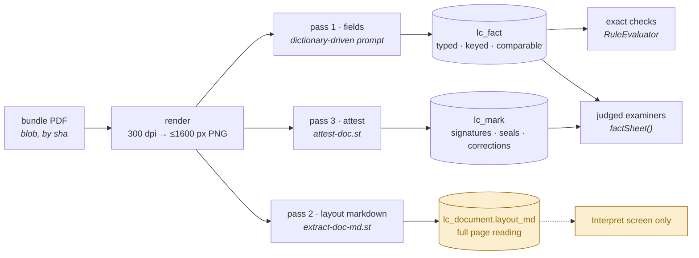
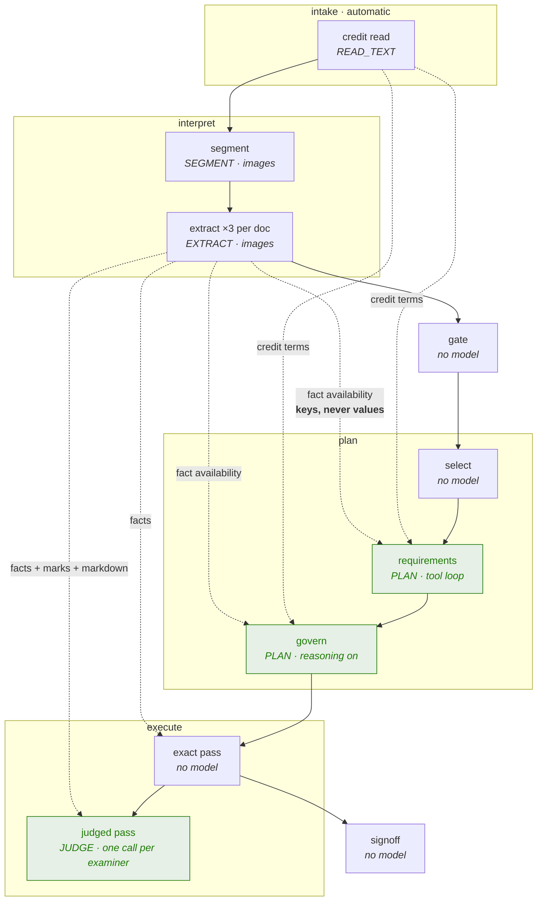
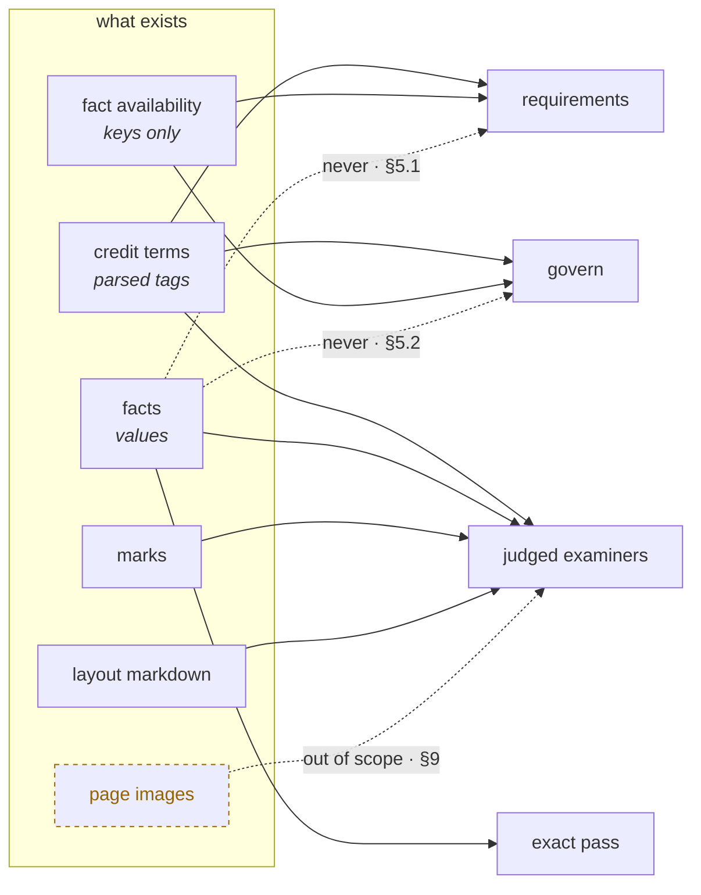

# Evidence and the four agents

What each model call is given, and why.

> This decides the **inputs**. The ordered implementation is
> [`docs/plan/expression-and-evidence.md`](../plan/expression-and-evidence.md).
> For where a class goes, see [`package-layout.md`](package-layout.md); for the authored rule
> language, [`rule-set.md`](rule-set.md).

---

## 1. Why this document

The examination makes four calls that reason rather than read — **requirements**, **govern**, and
the judged **examiners**, plus the exact pass, which makes none. Each receives whatever the stage
that wrote it happened to have in hand, and the omissions are not decisions. They are oversights
that have never been looked at together.

Three of them are worth naming before anything else:

- The **layout markdown** — a full, page-ordered transcription of every presented document,
  produced by a model call we already pay for and stored in `lc_document.layout_md` — is read by
  **the UI and nothing else**. No stage sees it.
- The **planner** is told nothing about what was actually extracted, so it can compile a condition
  against a field nobody reads. That check plans, stores, runs, and returns INCONCLUSIVE for ever
  while looking exactly like a check that ran.
- The **examiner** cannot tell a dictionary-bound reading from a field the extractor invented, or
  an amended credit term from an original one. `factSheet()` renders neither `flag` nor `source`.

---

## 2. What the system already produces

Every presented document is read **three times, sequentially, from byte-identical 1600 px page
renders**. The sequencing is deliberate: the three passes ride each other's prefix cache, and
firing them together would pay full image tokens three times over.



| carrier | what it is | provenance | who reads it today |
|---|---|---|---|
| **facts** (`lc_fact`) | the dictionary's questions, answered | doc code + page (§8) | exact checks and the fact sheet — fully consumed |
| **marks** (`lc_mark`) | what is on the page rather than in its text | doc code + page + placement | the fact sheet, as flattened prose |
| **layout markdown** | the whole document, in visual order, tables intact | page separators | **nothing but the UI** |
| **page images** | the truth | page number | interpret's three passes, then discarded (L1, 10 min, in-process) |
| **the credit** | SWIFT tags, parsed | per-tag anchors, minted and then dropped (§8.2) | intake → everything |

The first three are **already bought**. The decision is not what to pay for. It is what to show.

---

## 3. The choice: facts, markdown, or the page

The tempting framing is *the cheapest carrier that works*. It is the wrong one, because the three
do not answer the same question — and because the cost ordering is not stable.

### 3.1 Cost is not ordered the way it looks

**An image's cost is fixed by its geometry. Markdown's cost is set by how much the page says.**

| page | as an image (1600 px) | as markdown |
|---|---|---|
| a commercial invoice | ~1,500–2,500 tok | ~500–1,000 tok — markdown wins |
| a bill of lading, front | ~1,500–2,500 tok | ~700–1,200 tok — markdown wins |
| **a bill of lading, reverse** — carrier's standard conditions, 3,000 words of 6-point type | ~1,500–2,500 tok | **~4,000–5,000 tok** — the image wins, and the markdown answers nothing |

The reverse of a bill of lading is the worst case, and it is in almost every real bundle: the
largest markdown block in the presentation, carrying the least. Any design resting on *"markdown is
cheaper"* is wrong on exactly the page that costs the most.

### 3.2 Fidelity is not ordered the way it looks either

Markdown is **a lossy transcription made by a model** — one reading of the page, frozen. It renders
a signature as an italic note, and whether a stamp was legible was a judgement made at
transcription time by a prompt that was not asking about legibility. The image carries the truth;
the markdown carries an opinion about it.

But the image is not simply better, because **a general examiner handed a page asks worse questions
of it than the attest pass already asked.** `attest-doc.st` asks about facsimile and perforated
signatures and chops (UCP 600 art. 3), about corrections and the initials that authenticate them
(ISBP 821 §A), about `ORIGINAL` marking (art. 17), about the capacity a signature was given in
(art. 20(a)(i)). It also holds the distinction that matters most, and that a general reader loses:

> *"There is a signature and I cannot read whose it is"* is **not** the same statement as
> *"this document is unsigned"*. Only the second is a discrepancy.

### 3.3 The rule

Choose by **what the check asks**, never by what the carrier costs.

| the check asks | carrier | why |
|---|---|---|
| does field X on this document agree with field Y on that one | **facts** | it is a comparison, a comparison needs values, and values are what facts are |
| does this document's wording correspond with the credit's | **markdown** | wording judgements need the whole wording in its own order — folding it into fields is what destroyed the information |
| is it signed, sealed, altered, marked original, signed in a stated capacity | **marks** | the question was already asked by a prompt that knew which articles govern it. Re-sending the page to ask it worse is paying twice for less |
| nothing above can settle it | **the page** | out of scope this round — §9 |

Which answers the three standing questions directly:

1. **Markdown or the pages?** Markdown, for wording. Never the pages, this round.
2. **Facts or the pages?** Facts, for comparison. The extraction already happened; re-reading a page
   to recover a value we are holding is two completions for no new information.
3. **Signature detection — the prior result, or the page?** **The prior result.** The attest pass is
   a better instrument than the question a general examiner would think to ask, and its answer is
   already stored.

---

## 4. An operand must trace to a document

A separate constraint, and the one that keeps the catalogue honest.

Every operand and every literal in a condition must be traceable. Four forms are legitimate:

| form | example | traces to |
|---|---|---|
| a field on a presented document | `{BOL.on_board_date}` | the presentation |
| a field on the credit | `{LC.latest_shipment_date}` | the credit |
| a constant from the **rulebook** | `21` in *"within 21 calendar days of shipment"* | UCP 600 art. 14(c), cited on the check |
| a literal **quoted from this credit** | an issuer named in tag 47A | 47A, with the quote recorded on the card |

And one is not: **a constant the author typed because they know this deal.** A standing rule in the
catalogue applies to every credit. A standing rule naming a port, a party or an amount is a rule
about one transaction wearing a rulebook's clothes — it will be wrong on the next credit, and
silent about it.

The split follows the card's own provenance, and is enforceable:

- a **dictionary** check (`origin = DICTIONARY`) may carry rulebook constants only. A business
  literal in one is a compile-time warning.
- a **requirement** card (`origin = CREDIT`, ids `REQ-46A.n` / `REQ-47A.n`) may carry a literal,
  because it is scoped to this credit and the planner read it out of 47A — but the quote and its
  tag must ride beside it, so a person can check that the credit really says so.

> This is also why the planner is given the credit's terms and not the presentation's values
> (§5.1). A literal must come from what the credit **demands**, never from what a document happens
> to **say**: a condition compiled from the presentation is a rule that passes by construction.

---

## 5. The four agents



### 5.1 `requirements` — reading what the credit demands

**Its question:** what does this credit require, and which requirements can be settled by comparison
rather than by reading?

| | given | why |
|---|---|---|
| keep | `plan-requirements.st`, the document-type codes, the comparable-field vocabulary by document, the operators, the functions | it is compiling, and it needs the vocabulary it must compile into |
| keep | tag 46A, tag 47A | the two blocks the requirements are read out of |
| **add** | **the credit's other terms** — the parsed tag map, not just 46A/47A | 47A routinely references tags it does not restate: *"presentation within the validity of the credit"*, *"shipment as per 44C"*. Today the planner cannot see 44C and must guess or give up. The data is already loaded and costs one block |
| **add** | **fact availability** — per document, which field keys came back with something, which came back empty, which documents were not presented. Keys only | two failures, one block. It stops the planner compiling against a field nobody extracts — the check that plans, stores, runs and returns INCONCLUSIVE for ever while looking like a check that ran. And it shows which demands are simply unanswerable this time, so they can be raised as human cards instead of as conditions |
| **never** | field **values** | the planner writes conditions. Handed values it answers them instead, and the answer is a model's opinion wearing an exact check's clothes. It also breaks §4 |
| **never** | page images | 46A/47A are text in the credit, and a credit that arrived as a scan was already transcribed upstream by `CreditScanTranscriber`. An image here pays interpret's bill a second time for a question that is not about the page |
| **never** | layout markdown, marks | it is reading the **credit**, not the documents. What the documents say is execute's question, and answering it here would answer it in the wrong place with the wrong vocabulary |

**Tools:** `check_condition` and `article_text`, both already present. **No fact-query tool** — the
availability list is small enough to inline, and a tool returning values reintroduces exactly the
failure the keys-only rule exists to prevent.

**A consequence to state where it will be noticed.** `requirements` keys its derivation cache on the
volatile digest, so adding availability means two presentations with different extraction outcomes
stop sharing a cached plan. That is correct — they *should* get different plans — but the hit rate
will fall, and it will read as a cost regression unless the step's completion note says so.

### 5.2 `govern` — deciding what is worth running

**Its question:** given this credit and this presentation, which of these checks should actually
run, and what must a person be asked?

| | given | why |
|---|---|---|
| keep | the threshold verdicts, the credit terms, 46A, 47A, the candidate standing rules, the requirement cards | its whole job is weighing these against each other |
| **add** | **fact availability** — the same block | *is this check worth running* is partly *can it be answered at all*. A check whose operands read fields nobody extracted will cost a model call to return INCONCLUSIVE. Govern is the only place that can stand it down — and the only place that raises the card which makes standing it down safe |
| **never** | facts, marks, markdown, images | **govern's output vocabulary has no slot for a conclusion.** It returns `suppress`, `gateOverride`, `runRemaining`, `humanReview`; there is nowhere to record a finding. Giving it evidence therefore produces either a conclusion that is discarded, or worse, one that leaks out as a suppression — a check stood down because the model privately decided it would have passed. That is a finding with no evidence trail and nobody's signature on it |

The standing constraint holds unchanged and is what makes any of this safe: **a suppression always
raises a review card**, and the planner cannot stop a run no threshold check objected to.

### 5.3 `execute` — the exact pass

No model. Operands resolve against `lc_fact`, the condition is walked, and every row's working is
written to `lc_finding.comparison` as the evidence a refusal is defended on.

Nothing is added here. What is needed here is **fidelity**, not more evidence — §8.

### 5.4 `execute` — the judged pass

**Its question:** read this presentation and answer these checks, which fall in your remit.

| | given | why |
|---|---|---|
| keep | `examine-checks.st`, the shared fact sheet, the remit (agent behaviour + article text), the checks | unchanged |
| **add** | **quality signals inside the fact sheet** — an off-dictionary reading marked visibly; a credit term's source carried, so an amended term is distinguishable from an original | today an invented field and a dictionary-bound one are typographically identical to the judge, and so are an amended term and an original one. Both failures are silent, and both change the answer |
| **add** | **the layout markdown of the documents this examiner's checks name**, placed **after** the shared fact sheet | already paid for, page-ordered, and the only place a table survives intact (§8.1). A wording check — *does the invoice's goods description correspond with the credit's* — needs the wording, and folding it into fields is precisely what destroyed it |
| not this round | page images | §9 |

**Scoping and the cap.** Markdown is included only for documents named by this remit's checks, and
is capped per document with the truncation **stated in the block**. The reverse of a bill of lading
is the reason. Silent truncation would read as *"you have been shown the whole document"*, which is
the one thing evidence must never do.

---

## 6. Merging the examiner prompt

The answer to *how does it merge* is an ordering, and the ordering is a cost decision rather than a
style one.

```
┌─ the prefix the first group warms, and every later group rides ─────┐
│  1  HOW TO ANSWER              stable     examine-checks.st         │
│  2  THE PRESENTATION           shared     byte-identical per case   │
└─────────────────────────────────────────────────────────────────────┘
   3  THE DOCUMENTS IN YOUR REMIT   per-remit   ← the new block
   4  YOUR REMIT                    per-remit
   5  THE CHECKS                    per-remit
```

`execute` runs the **first group alone** and fans the rest out behind it, precisely because a
provider only holds a prefix once a call carrying it has returned. That warming works only while
blocks 1–2 are identical across examiners.

**So the new markdown block sits below the boundary, not above it.** Per-remit documents before the
shared fact sheet would give every examiner a different prefix, and the first-group-alone design
would become pure latency for no saving — a regression that surfaces as a cost number nobody can
trace back to a block ordering.

`PromptContext` renders `STABLE` then `VOLATILE`, but blocks 2–5 are all volatile today, so the
boundary is **positional and maintained by hand**. It should be a type — a third tier rendering
between the two — so the constraint is enforced rather than remembered.

---

## 7. What each call receives, end to end



| | credit terms | fact availability | fact values | marks | markdown | images |
|---|:---:|:---:|:---:|:---:|:---:|:---:|
| **requirements** | ✅ *widen* | ➕ | ❌ | ❌ | ❌ | ❌ |
| **govern** | ✅ | ➕ | ❌ | ❌ | ❌ | ❌ |
| **exact pass** | ✅ | — | ✅ | ❌ | ❌ | ❌ |
| **judged examiners** | ✅ | — | ✅ ➕ *signals* | ✅ | ➕ *remit-scoped* | ❌ §9 |

---

## 8. What must be fixed before an exact check can be trusted

Upstream of everything above, and of the condition-language work. A comparison is only as good as
the value underneath it, and three defects make some values **wrong** rather than missing — which
is worse, because a wrong value produces a confident discrepancy.

### 8.1 A repeated or tabular field is destroyed, and the loss looks like a discrepancy

Three independent chokepoints, each fatal on its own: the extraction prompt asks for *"a flat object
of field name to value"*; `ExtractionSpec.read()` uses `putIfAbsent`, so a second value for a folded
key is dropped; and `lc_fact` carries `UNIQUE (case_id, doc_code, label)`. When the model does
return a list, `FactWriter` serialises it into one TEXT cell and `value_norm` uppercases the JSON.

```
a bill of lading with two loading ports

  stored     BOL.port_of_loading = '["SHANGHAI","NINGBO"]'      ← one cell
  compared   LC.port_of_loading  eq  BOL.port_of_loading
             "SHANGHAI"  vs  '["SHANGHAI","NINGBO"]'   →   DISCREPANT

  a discrepancy that does not exist, indistinguishable from one that does
```

A packing list's item table goes the same way. **The prompt shape has to change first** — no schema
change alone reaches it.

**The fix.** Let the dictionary mark a binding `repeatable`; let the extraction prompt return an
array for those; give `lc_fact` an `ordinal` and move the unique key to
`(case_id, doc_code, label, ordinal)`; and give the condition language set semantics
(`anyOf` / `allOf` / `noneOf`) so a multi-valued operand is comparable rather than string-matched.
Both sides of such a comparison remain fields — nothing is hardcoded (§4).

**The safe minimum, if the full fix must wait:** `FactWriter` flags a value it had to serialise, and
the evaluator returns **INCONCLUSIVE** rather than FAIL on a flagged operand. Every multi-valued
field then falls to a person, which is honest and cheap. What is not acceptable is leaving it as it
is, because the current behaviour is a confident wrong answer.

### 8.2 Provenance below the document does not exist

`FactWriter` stamps every fact with the document's **first** page — every fact on an eight-page bill
of lading points at page one. `anchor_id`, `source_text` and `value_type` are never written at all,
although `SwiftReader` **already mints** a per-tag anchor for the credit and `writeCreditFacts`'s
own javadoc promises to use it.

Three consequences are live dead code: `GateStage.creditAnchor()` always returns null, so every
finding's `credit_anchor_id` is null; Review's credit pane never highlights the line a finding hangs
off; and every credit fact row in Interpret is inert. **The plumbing exists end to end and carries
nothing.** Passing `anchorId` through one `Rows.of(...)` lights all three.

### 8.3 A real confidence signal is computed and thrown away

`lc_fact.confidence` is the constant `"HIGH"`, while the vision consensus in `StandardLlmGateway`
**does** compute per-field agreement across slots. Nothing carries it into the fact. The UI's LOW
chip and its low-confidence header are therefore unreachable, and `NOT_EXTRACTED` — the outcome
reason whose entire purpose is to make *"our reading is weak on this field"* visible across a
hundred cases — has no way to say how weak.

---

## 9. Deliberately out of scope, and why

**Sending page images to an examiner.** Four reasons, in order of weight:

1. **The image's unique contribution is already captured, better.** What a page carries beyond its
   text is signatures, seals, alterations and originality marks — and the attest pass asks about
   those with UCP 600 art. 3 / art. 17 / art. 20(a)(i) and ISBP 821 §A in the prompt. A general
   examiner handed the same page asks none of that.
2. **It is a harness change, not a config change.** `TextRequest` and `ToolRequest` have **no image
   channel**; `VisionRequest` has **no system message and no tools**. The underlying `Content` type
   is a sealed `Text | Image` and can express any interleaving, so the change is bounded — but it is
   a change to the port every backend implements.
3. **An image-bearing call cannot ride the shared prefix.** Images must lead the content list — that
   ordering is roughly a 3× input bill if broken — so an escalated examiner call is its own
   full-price call. Fine if there are few; a cost cliff if the trigger is loose.
4. **Nothing currently asks for it.** No check in either catalogue is blocked on a fresh look that
   the marks do not answer.

**When it does come**, the mechanism has a precedent and should reuse it rather than invent one:
`PlanStage` emits an `attest` map — *these documents, for these page properties* — and
`ExecuteStage`'s first step consumes it. An `escalate` map is the same shape: declared by the plan,
honoured by execute, and **never speculative**.

**Letting an examiner trigger its own second look** is further out still. It is a re-run loop, and
the standing rule here is that *a spent budget is treated as no answer, never as a conclusion*. A
loop without a turn budget is how an unbounded agent loop against a paid API gets back in.

---

## 10. What this implies for the condition language

The expression-language work sits **downstream** of this document, and the ordering matters.

- §8.1 is a **prerequisite**, not a companion. `{BOL.port_of_loading}` is only as trustworthy as
  what is stored under it; shipping a new comparison language over a fact model that turns two
  loading ports into a false discrepancy would get the language blamed for the fact model's defect.
- §4 becomes a **compiler rule**: a business literal in a dictionary-origin check is a warning; in a
  credit-origin requirement card it must carry its quote and tag.
- §5.1's availability block is what lets a rejection message be *actionable* — *"that field is not
  read from that document on this presentation"* is a different and far more useful sentence than
  *"that field is not in the dictionary"*.
- Set semantics join the verb list, because §8.1 creates multi-valued operands and a language that
  cannot compare them would force every one of them to a person.

---

## 11. Open decisions

| | question | leaning |
|---|---|---|
| 1 | §8.1 — the full fix (`repeatable` + `ordinal` + set operators), or the safe minimum (flag → INCONCLUSIVE)? | full fix; the minimum sends every multi-valued field to a person for ever |
| 2 | The per-document markdown cap — one number, or scaled by how many documents the remit names? | one number, stated on truncation. Scaling is a knob nobody will tune |
| 3 | Does `PromptContext` gain a typed shared tier, or does §6's boundary stay positional? | typed; a positional constraint maintained by hand is a cost regression waiting to happen |
| 4 | §8.2 — is lighting the credit anchor in scope, or its own change? | its own change. Three lines and no design, but it touches four screens |
