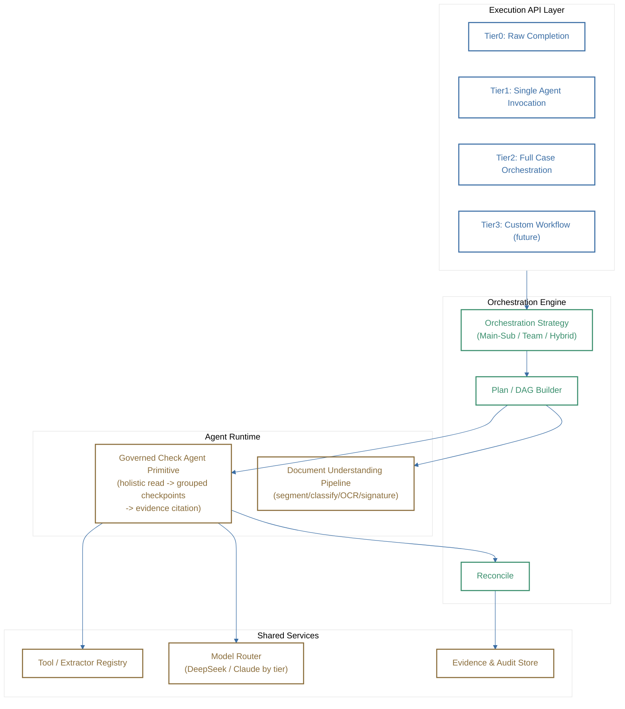

## harness



## lc check

```mermaid
%%{init: {'theme':'base','themeVariables':{'background':'#ffffff','primaryColor':'#ffffff','lineColor':'#3b6ea5','primaryTextColor':'#1a2b3c'}}}%%
flowchart TB
    classDef ui stroke:#3b6ea5,stroke-width:2px,color:#3b6ea5,fill:none
    classDef biz stroke:#2f6690,stroke-width:2px,color:#2f6690,fill:none
    classDef harness stroke:#3a8f6d,stroke-width:2px,color:#3a8f6d,fill:none
    classDef data stroke:#8a6d3b,stroke-width:2px,color:#8a6d3b,fill:none

    subgraph UI["Presentation"]
        WB["LC Check Workbench"]
        GC["LC Compliance Console"]
    end

    subgraph BIZ["LC Check Business Layer"]
        CASESVC["Case Workflow Service"]
        GOVSVC["Governance Service"]
        INGEST["Case Ingestion<br/>(MT700 parse, doc upload)"]
        REVIEW["Review & Feedback Service"]
    end

    subgraph HC["Harness Core (Tier2 call)"]
        EXEC["Execute Case API"]
    end

    subgraph DATA["LC Check Data"]
        PG[("PostgreSQL<br/>Case / Findings / Workflow")]
        GOVSTORE[("Governance Store<br/>Domain Agents / Checkpoints")]
        VEC[("pgvector<br/>Case Library embeddings")]
    end

    WB --> CASESVC
    GC --> GOVSVC
    CASESVC --> INGEST
    CASESVC -->|"case_id + LC fields<br/>+ documents + governance payload"| EXEC
    REVIEW -->|"accept/override/flag-as-case"| CASESVC
    EXEC -->|"findings stream"| CASESVC

    CASESVC --> PG
    GOVSVC --> GOVSTORE
    GOVSVC --> VEC
    GOVSVC -.->|"reads at invocation time"| EXEC

    class WB,GC ui
    class CASESVC,GOVSVC,INGEST,REVIEW biz
    class EXEC harness
    class PG,GOVSTORE,VEC data
    ```


## lc logical flow
```mermaid
LC Check — Logical Solution Flow (