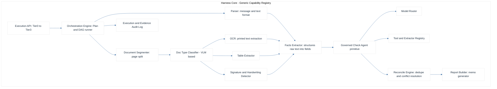
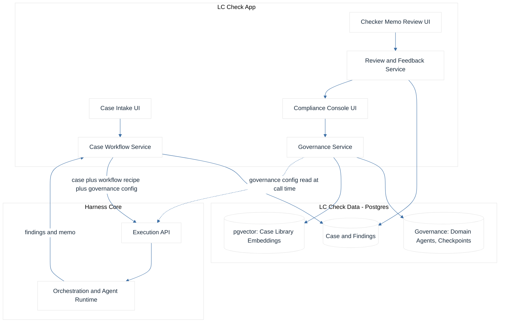
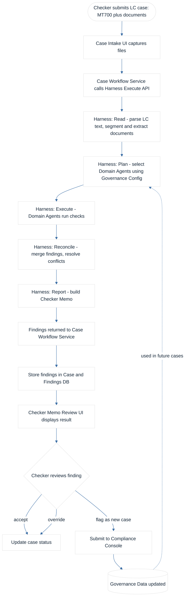

## h2

```mermaid
%%{init: {'theme':'base','themeVariables':{'background':'#ffffff','primaryColor':'#ffffff','lineColor':'#3b6ea5','primaryTextColor':'#1a2b3c'}}}%%

flowchart TB
    subgraph HARNESS[Harness Core - Generic Capability Registry]
        REG_API[Execution API: Tier0 to Tier3]
        REG_ORCH[Orchestration Engine: Plan and DAG runner]
        REG_PARSE[Parser: message and text format]
        REG_SEG[Document Segmenter: page split]
        REG_CLASSIFY[Doc Type Classifier - VLM based]
        REG_OCR[OCR: printed text extraction]
        REG_TABLE[Table Extractor]
        REG_SIG[Signature and Handwriting Detector]
        REG_FACTS[Facts Extractor: structures raw text into fields]
        REG_AGENT[Governed Check Agent primitive]
        REG_RECON[Reconcile Engine: dedupe and conflict resolution]
        REG_REPORT[Report Builder: memo generator]
        REG_MODEL[Model Router]
        REG_TOOLS[Tool and Extractor Registry]
        REG_AUDIT[Execution and Evidence Audit Log]
    end

    REG_API --> REG_ORCH
    REG_ORCH --> REG_PARSE
    REG_ORCH --> REG_SEG
    REG_SEG --> REG_CLASSIFY
    REG_CLASSIFY --> REG_OCR
    REG_CLASSIFY --> REG_TABLE
    REG_CLASSIFY --> REG_SIG
    REG_PARSE --> REG_FACTS
    REG_OCR --> REG_FACTS
    REG_TABLE --> REG_FACTS
    REG_SIG --> REG_FACTS
    REG_FACTS --> REG_AGENT
    REG_AGENT --> REG_MODEL
    REG_AGENT --> REG_TOOLS
    REG_AGENT --> REG_RECON
    REG_RECON --> REG_REPORT
    REG_ORCH --> REG_AUDIT
```

## Diagram 2: LC Check - Overall Technical Component Picture

```mermaid
%%{init: {'theme':'base','themeVariables':{'background':'#ffffff','primaryColor':'#ffffff','lineColor':'#3b6ea5','primaryTextColor':'#1a2b3c'}}}%%

flowchart TB
    subgraph CLIENT[LC Check App]
        UI1[Case Intake UI]
        UI2[Checker Memo Review UI]
        UI3[Compliance Console UI]
        SVC1[Case Workflow Service]
        SVC2[Governance Service]
        SVC3[Review and Feedback Service]
    end

    subgraph DATA[LC Check Data - Postgres]
        DB1[(Case and Findings)]
        DB2[(Governance: Domain Agents, Checkpoints)]
        DB3[(pgvector: Case Library Embeddings)]
    end

    subgraph HARNESS[Harness Core]
        API[Execution API]
        ENGINE[Orchestration and Agent Runtime]
    end

    UI1 --> SVC1
    UI2 --> SVC3
    UI3 --> SVC2
    SVC1 --> DB1
    SVC2 --> DB2
    SVC2 --> DB3
    SVC3 --> DB1
    SVC3 --> UI3

    SVC1 -->|case plus workflow recipe plus governance config| API
    SVC2 -.->|governance config read at call time| API
    API --> ENGINE
    ENGINE -->|findings and memo| SVC1
```

## h3

```mermaid
%%{init: {'theme':'base','themeVariables':{'background':'#ffffff','primaryColor':'#ffffff','lineColor':'#3b6ea5','primaryTextColor':'#1a2b3c'}}}%%

flowchart TB
    START([Checker submits LC case: MT700 plus documents])
    START --> INTAKE[Case Intake UI captures files]
    INTAKE --> WFCALL[Case Workflow Service calls Harness Execute API]

    WFCALL --> READ[Harness: Read - parse LC text, segment and extract documents]
    READ --> PLAN[Harness: Plan - select Domain Agents using Governance Config]
    PLAN --> EXEC[Harness: Execute - Domain Agents run checks]
    EXEC --> RECON[Harness: Reconcile - merge findings, resolve conflicts]
    RECON --> REPORT[Harness: Report - build Checker Memo]

    REPORT --> RETURN[Findings returned to Case Workflow Service]
    RETURN --> STORE[Store findings in Case and Findings DB]
    STORE --> SHOW[Checker Memo Review UI displays result]

    SHOW --> DECISION{Checker reviews finding}
    DECISION -->|accept| CLOSE[Update case status]
    DECISION -->|override| CLOSE
    DECISION -->|flag as new case| GOVUPDATE[Submit to Compliance Console]
    GOVUPDATE --> GOVDB[(Governance Data updated)]
    GOVDB -.->|used in future cases| PLAN
```